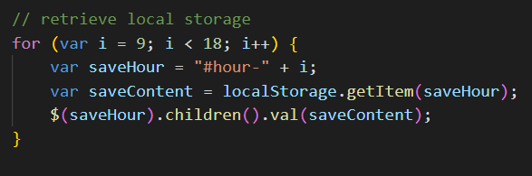

# Work Day Scheduler
## Overview
For this project I created a scheduling app that allows you to input scheduled events between the hours of 9am and 5pm. You can save your schedule to come back to later and the schedule adjusts to show current, past and future hours.

## Keeping track of time
The application uses moment.js to keep track of the current time and update the scheduler. The current time is set to a timer so that it can be updated every second to reflect the real time.

As well as updating the current day and time, the init function also sets the colors of the timeblocks. This is done by grabbing the current hour from moment.js and setting the colors of the timeblock that matches the hour and the timeblocks before the current hour.

## Storing the events
The final part of this application is the ability to store and update events. Data is saved for a timeblock when the save button is pressed for that specific timeblock. If the save button is not pressed, the changes are not saved. The events are stored in local storage and are retrieved whenever the init function is run.

